# Infraestructura 1 – Seguridad de Redes

**Estudiante:** Merolyn Mejía  
**Matrícula:** 2025-0827  
**Asignatura:** Seguridad de Redes  
**Práctica:** Infraestructura 1  

---

## 🎥 Video demostrativo

▶️ **Video de demostración:**  
https://youtu.be/D94mXhJJL-g

> En el video demuestro el funcionamiento de los principales controles de seguridad implementados en la infraestructura, incluyendo segmentación mediante VLAN, DMZ, control de acceso SSH, restricciones entre redes y registros de violaciones de políticas.

---
# 📑 Índice

1. [Descripción del laboratorio](#1-descripción-del-laboratorio)
2. [Propósito del laboratorio](#2-propósito-del-laboratorio)
3. [Topología](#3-topología)
4. [Plan de direccionamiento IP](#4-plan-de-direccionamiento-ip)
5. [Configuración del FortiGate](#5-configuración-del-fortigate)
6. [DHCP](#6-dhcp)
7. [Configuración de la DMZ](#7-configuración-de-la-dmz)
8. [Servidores web](#8-servidores-web)
9. [Servidor de base de datos](#9-servidor-de-base-de-datos)
10. [Objetos de direcciones del FortiGate](#10-objetos-de-direcciones-del-fortigate)
11. [Políticas de seguridad](#11-políticas-de-seguridad)
12. [Bloqueo de SSH desde VLAN 10](#12-bloqueo-de-ssh-desde-vlan-10)
13. [Bloqueo del Sistema de Inventario para VLAN 10](#13-bloqueo-del-sistema-de-inventario-para-vlan-10)
14. [Protección de las redes internas](#14-protección-de-las-redes-internas)
15. [Restricción de Internet para la DMZ](#15-restricción-de-internet-para-la-dmz)
16. [Configuración de VLAN en el switch](#16-configuración-de-vlan-en-el-switch)
17. [Puerto de VLAN 10](#17-puerto-de-vlan-10)
18. [Puerto de VLAN 20](#18-puerto-de-vlan-20)
19. [Port Security](#19-port-security)
20. [PortFast y BPDU Guard](#20-portfast-y-bpdu-guard)
21. [Puertos no utilizados](#21-puertos-no-utilizados)
22. [Administración segura del switch](#22-administración-segura-del-switch)
23. [Verificaciones realizadas](#23-verificaciones-realizadas)
24. [Evidencias](#24-evidencias)
25. [Conclusión](#25-conclusión)

---
---

# 1. Descripción del laboratorio

En esta práctica se diseñó y configuró una infraestructura de red utilizando **GNS3**, un firewall **FortiGate**, un switch Cisco, dos equipos de usuarios y tres servidores.

El objetivo principal fue crear una red segmentada y aplicar controles de seguridad que permitan controlar qué dispositivos pueden comunicarse entre sí.

La infraestructura fue dividida en:

- VLAN 10 – Usuarios
- VLAN 20 – Usuarios autorizados para SSH
- DMZ – Servidores
- WAN – Salida hacia Internet

El FortiGate funciona como el dispositivo principal de seguridad, controlando la comunicación entre las diferentes redes mediante políticas de firewall.

---

# 2. Propósito del laboratorio

El propósito de este laboratorio es aplicar de manera práctica conceptos de seguridad de redes como:

- Segmentación mediante VLAN.
- Separación de servidores mediante una DMZ.
- Control del tráfico mediante políticas de firewall.
- Restricción del acceso SSH.
- Restricción del acceso de usuarios a determinados servidores.
- Bloqueo del tráfico iniciado desde la DMZ hacia las redes internas.
- Restricción del acceso a Internet de los servidores.
- Registro de violaciones de políticas.
- Configuración básica de seguridad en un switch.
- Uso de Port Security.
- Uso de BPDU Guard.
- Administración segura mediante SSH.

---

# 3. Topología

## Diagrama
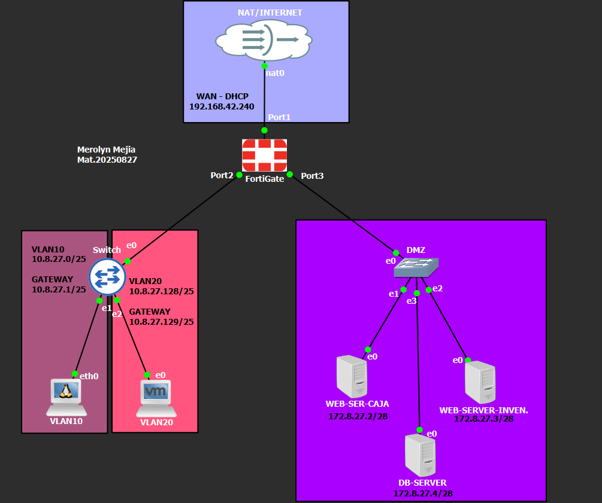

### Equipos utilizados

- 1 FortiGate
- 1 Cisco IOSvL2
- 1 switch Ethernet para la DMZ
- 1 cliente Alpine Linux
- 1 cliente Windows
- 2 servidores web Ubuntu
- 1 servidor de base de datos Ubuntu
- NAT de GNS3 para conexión a Internet

---

# 4. Plan de direccionamiento IP

| Red / Equipo | Dirección |
|---|---|
| VLAN 10 | 10.8.27.0/25 |
| Gateway VLAN 10 | 10.8.27.1 |
| Rango DHCP VLAN 10 | 10.8.27.2 - 10.8.27.126 |
| Cliente Alpine | 10.8.27.3 |
| VLAN 20 | 10.8.27.128/25 |
| Gateway VLAN 20 | 10.8.27.129 |
| Rango DHCP VLAN 20 | 10.8.27.130 - 10.8.27.254 |
| Cliente Windows | 10.8.27.130 |
| DMZ | 172.8.27.0/28 |
| Gateway DMZ | 172.8.27.1 |
| Web Server Caja | 172.8.27.2 |
| Web Server Inventario | 172.8.27.3 |
| DB Server | 172.8.27.4 |

El direccionamiento fue realizado tomando como referencia la matrícula **2025-0827**.

---

# 5. Configuración del FortiGate

T# 5. Configuración del FortiGate

Toda la configuración del FortiGate se realizó mediante su **interfaz gráfica (GUI)**, ya que este equipo funciona como el principal dispositivo de seguridad de la infraestructura. Su función es comunicar las diferentes redes y, al mismo tiempo, controlar mediante políticas qué tipo de tráfico puede pasar entre los usuarios, los servidores de la DMZ e Internet.

Para la conexión hacia Internet se utilizó la interfaz **port1**, configurada como WAN y conectada al NAT de GNS3. Esta interfaz obtuvo su dirección IP automáticamente mediante DHCP y permitió establecer la comunicación externa necesaria para el laboratorio.

La interfaz **port2** se utilizó como enlace trunk entre el FortiGate y el switch Cisco. Sobre esta interfaz se crearon las dos redes virtuales destinadas a los usuarios. La primera fue **VLAN10-USUARIOS**, identificada con el VLAN ID 10 y con la dirección de gateway `10.8.27.1/25`. La segunda fue **VLAN20-USUARIOS**, con VLAN ID 20 y la dirección de gateway `10.8.27.129/25`. De esta manera, los usuarios quedaron separados en dos redes diferentes y fue posible aplicar permisos distintos para cada una.

Por otra parte, la interfaz **port3** se destinó exclusivamente a la red de servidores y se identificó como **DMZ-SERVIDORES**. Esta interfaz utiliza la dirección `172.8.27.1/28`, que funciona como puerta de enlace para los tres servidores de la DMZ. A diferencia de los equipos de usuarios, los servidores fueron configurados con direcciones IP estáticas para mantener siempre el mismo direccionamiento y facilitar la creación de las políticas de seguridad.

Esta configuración permitió mantener separadas las redes de usuarios y servidores, dejando al FortiGate como punto de control para las comunicaciones entre ellas.

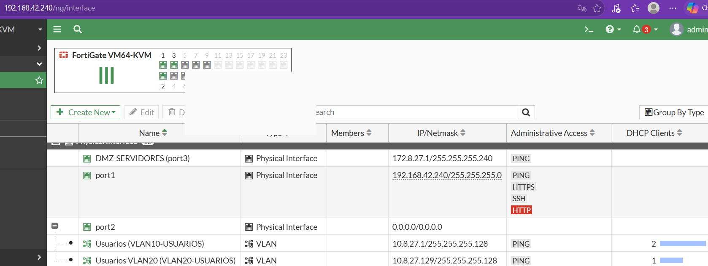 

---

# 6. DHCP

Para facilitar la asignación de direcciones IP a los equipos de usuarios, se configuró el servicio **DHCP desde la interfaz gráfica del FortiGate** para las VLAN 10 y VLAN 20. De esta manera, los dispositivos conectados a estas redes pueden recibir automáticamente una dirección IP, puerta de enlace y servidores DNS, sin necesidad de configurar estos datos manualmente en cada equipo.

Para la **VLAN 10**, se estableció como puerta de enlace la dirección `10.8.27.1` y se configuró un rango DHCP desde `10.8.27.2` hasta `10.8.27.126`. Este rango pertenece a la red `10.8.27.0/25` y permite entregar automáticamente el direccionamiento a los usuarios conectados a esta VLAN.

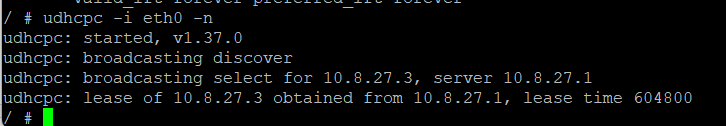

En la **VLAN 20**, se utilizó como puerta de enlace la dirección `10.8.27.129` y se estableció el rango DHCP desde `10.8.27.130` hasta `10.8.27.254`. Esta configuración corresponde a la red `10.8.27.128/25` y permite mantener a estos usuarios separados de los dispositivos pertenecientes a VLAN 10.

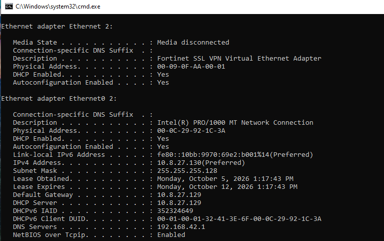

Para la resolución de nombres se configuraron los servidores DNS `8.8.8.8` y `1.1.1.1`. Finalmente, se realizaron pruebas desde los equipos de usuarios y se comprobó que podían obtener correctamente su configuración de red mediante DHCP. Con esto se confirmó tanto el funcionamiento del servicio como la correcta separación del direccionamiento entre las dos VLAN.

---

# 7. Configuración de la DMZ

Para aumentar la seguridad de la infraestructura, los tres servidores fueron ubicados dentro de una **DMZ (Zona Desmilitarizada)** independiente de las redes de usuarios. Para esta zona se utilizó la red `172.8.27.0/28`, mientras que la dirección `172.8.27.1` fue configurada en el FortiGate como puerta de enlace de los servidores.

Dentro de la DMZ se configuraron tres servidores con direcciones IP estáticas. El **Web Server del Sistema de Caja** utiliza la dirección `172.8.27.2` y tiene instalado Apache como servicio web. El **Web Server del Sistema de Inventario** utiliza la dirección `172.8.27.3` y también funciona mediante Apache. Finalmente, el **Database Server** fue configurado con la dirección `172.8.27.4` y utiliza MySQL como servicio de base de datos.

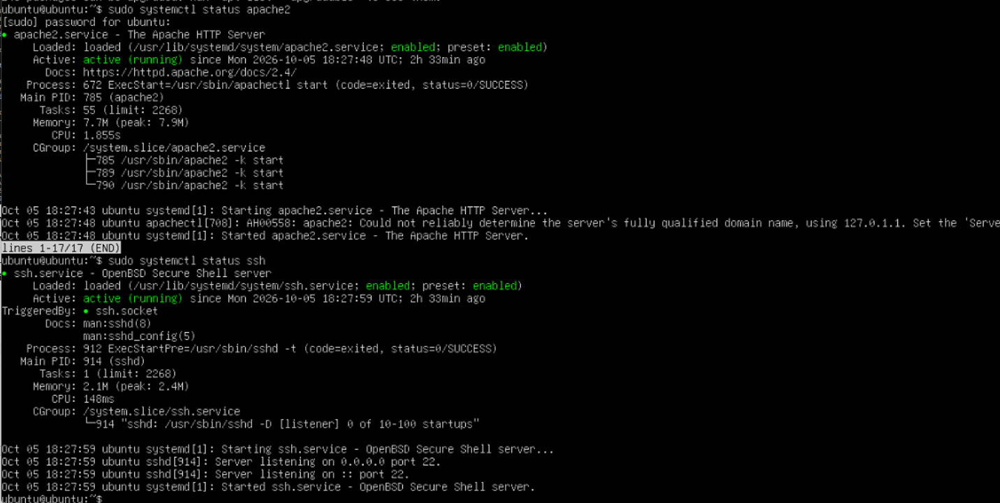

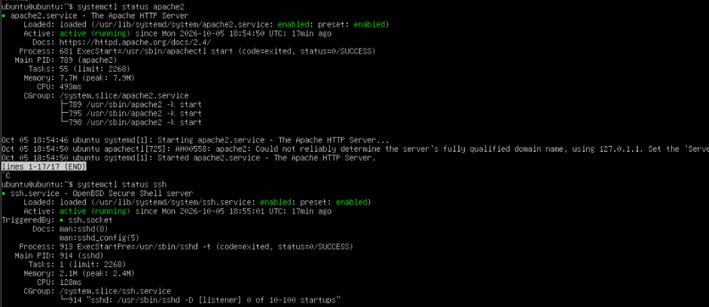

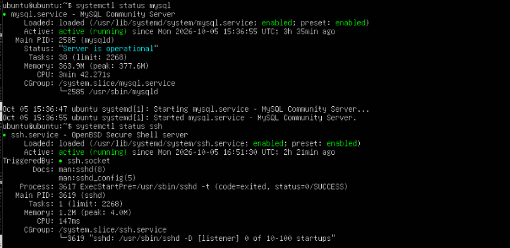

La creación de esta DMZ permite mantener los servidores separados de las VLAN de usuarios y utilizar el FortiGate como punto de control entre las diferentes redes. De esta manera, la comunicación hacia o desde los servidores depende de las políticas de seguridad configuradas y no existe una comunicación libre entre la DMZ y las redes internas.

Además, mantener direcciones IP estáticas en los servidores facilita la creación de las políticas del firewall, ya que cada servidor conserva siempre la misma dirección y puede ser identificado de forma específica dentro de las reglas de seguridad.

---

# 8. Servidores web

Se configuró Apache en los dos servidores web.

En el servidor:

    172.8.27.2

se creó una página correspondiente al:

**Sistema de Caja**

En:

    172.8.27.3

se creó una página correspondiente al:

**Sistema de Inventario**

Durante las pruebas se comprobó que Apache se encontraba activo y funcionando correctamente.

---

# 9. Servidor de base de datos

En el servidor:

    172.8.27.4

se configuró **MySQL Server**.

Se creó la base de datos:

    sistema_empresa

También se configuró un usuario para permitir la comunicación de los servidores web con la base de datos.

Las pruebas realizadas desde ambos servidores web confirmaron que podían conectarse correctamente al servidor MySQL.

---

# 10. Objetos de direcciones del FortiGate

Para facilitar la administración de las políticas se crearon objetos para representar las diferentes redes y servidores.

Entre los objetos utilizados se encuentran:

    VLAN10-USUARIOS
    VLAN20-USUARIOS
    DMZ-SERVIDORES
    WEB-CAJA
    WEB-INVENTARIO
    DB-SERVER
    DNS-GOOGLE
    DNS-CLOUDFLARE
    UBUNTU-ARCHIVE
    UBUNTU-SECURITY

Esto permite utilizar nombres descriptivos dentro de las políticas en lugar de trabajar solamente con direcciones IP.

---

# 11. Políticas de seguridad

Para controlar el tráfico entre las diferentes redes, se crearon varias políticas de seguridad en el FortiGate. Una de ellas fue **`VLAN20-SSH-DMZ`**, diseñada para que únicamente los usuarios de la **VLAN 20** puedan conectarse mediante **SSH** a los servidores de la DMZ, incluyendo el Sistema de Caja, el Sistema de Inventario y el servidor de base de datos. Para comprobar su funcionamiento, se realizó una conexión SSH desde el equipo Windows de la VLAN 20 hacia el servidor de base de datos y el acceso fue permitido correctamente, confirmando que la política funcionaba según lo establecido.

---

# 12. Bloqueo de SSH desde VLAN 10

Para impedir que los usuarios de la **VLAN 10** administren los servidores de la DMZ mediante SSH, se creó la política **`BLOQUEO-VLAN10-SSH`**, configurada para denegar este tipo de tráfico. Para comprobar su funcionamiento, desde el cliente Alpine de la VLAN 10 se intentó realizar una conexión SSH hacia el servidor `172.8.27.4`, pero el acceso fue bloqueado. Al revisar los registros del FortiGate se observó el mensaje **`Deny: policy violation`**, confirmando que la política estaba funcionando correctamente y que la VLAN 10 no tenía permitido el acceso SSH a los servidores.

---

# 13. Bloqueo del Sistema de Inventario para VLAN 10

Para restringir el acceso de los usuarios de la **VLAN 10** al Sistema de Inventario, se creó la política **`BLOQUEO-VLAN10-INVENTARIO`**, configurada para denegar el tráfico HTTP desde esta VLAN hacia el servidor **`WEB-INVENTARIO`**. Para comprobar su funcionamiento, desde el cliente Alpine se intentó acceder al servidor `172.8.27.3` mediante el comando `wget -S -O- http://172.8.27.3`, pero la conexión fue bloqueada. Al revisar los registros del FortiGate, el intento apareció como **`Deny: policy violation`**, demostrando que la restricción funcionaba correctamente y que los usuarios de VLAN 10 no podían acceder al Sistema de Inventario.

---

# 14. Protección de las redes internas

Para evitar que los servidores ubicados en la **DMZ** puedan iniciar conexiones libremente hacia las redes internas, se crearon las políticas **`BLOQUEO-DMZ-VLAN10`** y **`BLOQUEO-DMZ-VLAN20`**, ambas configuradas para denegar el tráfico desde la DMZ hacia las VLAN de usuarios. Para comprobar estas restricciones, desde el servidor de Caja se realizaron pruebas de conectividad hacia el cliente de VLAN 10 (`10.8.27.3`) y el cliente de VLAN 20 (`10.8.27.130`), obteniendo en ambos casos un **100% de pérdida de paquetes**. Además, los intentos quedaron registrados en el FortiGate como tráfico denegado, confirmando que los servidores de la DMZ no pueden iniciar comunicaciones hacia las redes internas.

---

# 15. Restricción de Internet para la DMZ

Para evitar que los servidores de la **DMZ** tengan acceso abierto a Internet, se configuraron políticas que permiten únicamente las comunicaciones necesarias para su funcionamiento y actualización. Se autorizó el acceso a los servidores DNS `8.8.8.8` y `1.1.1.1`, así como a los repositorios `archive.ubuntu.com` y `security.ubuntu.com` mediante la política **`DMZ-UBUNTU-UPDATES`**, permitiendo solamente los servicios HTTP y HTTPS. Para comprobar la configuración se ejecutó `sudo apt update` desde uno de los servidores y la actualización se realizó correctamente, demostrando que la DMZ puede acceder a los servicios necesarios sin contar con una política general de acceso libre a Internet.

---

# 16. Configuración de VLAN en el switch

En el switch **Cisco IOSvL2** se configuraron las **VLAN 10 y VLAN 20** para mantener separados los dos grupos de usuarios dentro de la infraestructura. El puerto `GigabitEthernet0/0`, encargado de conectar el switch con el FortiGate, fue configurado en modo **trunk** utilizando encapsulación 802.1Q y permitiendo únicamente el tráfico correspondiente a las VLAN 10 y 20. De esta manera, ambas VLAN pueden utilizar el mismo enlace físico hacia el FortiGate sin perder su separación lógica, permitiendo que posteriormente las políticas de seguridad se apliquen de forma independiente a cada red.

---

# 17. Puerto de VLAN 10

El puerto **`GigabitEthernet0/1`** del switch fue configurado en modo **access** y asignado a la **VLAN 10**, ya que en este puerto se encuentra conectado el equipo correspondiente a los usuarios de esta red. Además, se aplicaron medidas de seguridad como **Port Security con aprendizaje Sticky**, utilizando el modo de violación `restrict` para limitar la conexión de dispositivos no autorizados. También se habilitaron **PortFast** y **BPDU Guard**, con el objetivo de permitir una conexión rápida del dispositivo final y proteger el puerto ante posibles BPDUs recibidas de manera no esperada. Con estas configuraciones se mejora la seguridad del puerto y se mantiene al usuario correctamente dentro de la VLAN 10.

---

# 18. Puerto de VLAN 20

El puerto **`GigabitEthernet0/2`** del switch fue configurado en modo **access** y asignado a la **VLAN 20**, permitiendo conectar el equipo correspondiente a los usuarios de esta red. Para aumentar la seguridad del puerto, se habilitó **Port Security con aprendizaje Sticky** y se estableció el modo de violación `restrict`, ayudando a limitar la conexión de dispositivos no autorizados. También se configuraron **PortFast** y **BPDU Guard** para agilizar la conexión del dispositivo final y proteger el puerto ante la recepción de BPDUs no esperadas. Esta configuración mantiene al usuario correctamente dentro de la VLAN 20 y agrega medidas básicas de protección al puerto del switch.

---

# 19. Port Security

Para aumentar la seguridad de los puertos utilizados por los usuarios, se implementó **Port Security** tanto en la VLAN 10 como en la VLAN 20. Esta configuración permite que el switch aprenda automáticamente la dirección MAC del dispositivo conectado mediante la función **Sticky** y limite la conexión de equipos no autorizados utilizando el modo de violación `restrict`. Durante las verificaciones, Port Security apareció como **Enabled**, el estado del puerto como **Secure-up** y el modo de violación como **Restrict**. También se confirmó que cada puerto tenía una dirección MAC Sticky aprendida, demostrando que la medida de seguridad quedó activa y funcionando correctamente.

---

# 20. PortFast y BPDU Guard

Los puertos de acceso también fueron protegidos mediante:

    spanning-tree portfast edge
    spanning-tree bpduguard enable

PortFast permite que los puertos destinados a equipos finales entren rápidamente en estado de reenvío.

BPDU Guard agrega protección ante la conexión no autorizada de dispositivos que envíen BPDUs en estos puertos.

---

# 21. Puertos no utilizados

Como medida adicional de seguridad, los puertos del switch que no forman parte de la infraestructura fueron deshabilitados.

Se utilizó:

    shutdown

y se agregó la descripción:

    PUERTO-NO-UTILIZADO

Esto reduce la posibilidad de que un dispositivo sea conectado a un puerto que no debería estar disponible.

---

# 22. Administración segura del switch

Para proteger la administración del switch se aplicaron varias medidas básicas de seguridad. Se configuró un **banner de acceso restringido** para indicar que solamente el personal autorizado puede ingresar al dispositivo y se habilitó la autenticación local en las líneas VTY. Además, se permitió únicamente el acceso remoto mediante **SSH**, evitando el uso de protocolos sin cifrado como Telnet. Para habilitar este servicio se configuró el dominio `infra1.local`, se utilizó **SSH versión 2** y se generaron claves **RSA de 2048 bits**. De esta manera, la administración remota del switch queda protegida mediante una conexión cifrada y autenticada. Por seguridad, las contraseñas y credenciales utilizadas durante el laboratorio no se publican en este repositorio.

---

# 23. Verificaciones realizadas

Durante el laboratorio se realizaron diferentes pruebas para comprobar el funcionamiento de la infraestructura.

| Prueba | Resultado |
|---|---|
| DHCP VLAN 10 | Correcto |
| DHCP VLAN 20 | Correcto |
| Apache Sistema de Caja | Activo |
| Apache Sistema de Inventario | Activo |
| MySQL DB Server | Activo |
| Web Server → DB | Permitido |
| VLAN 20 → SSH → DMZ | Permitido |
| VLAN 10 → SSH → DMZ | Bloqueado |
| VLAN 10 → Inventario | Bloqueado |
| DMZ → VLAN 10 | Bloqueado |
| DMZ → VLAN 20 | Bloqueado |
| DMZ → repositorios Ubuntu | Permitido |
| Port Security | Activo |
| BPDU Guard | Activo |
| Puertos no utilizados | Deshabilitados |

---

# 24. Evidencias

Las evidencias del laboratorio se encuentran en la carpeta:

    /Evidencias

Se incluyen capturas de:

1. Topología completa.
2. Interfaces del FortiGate.
3. DHCP VLAN 10.
4. DHCP VLAN 20.
5. Web Server Caja activo.
6. Web Server Inventario activo.
7. DB Server activo.
8. Políticas del FortiGate.
9. SSH permitido desde VLAN 20.
10. Logs de las políticas de seguridad.
11. Actualizaciones permitidas desde la DMZ.
12. VLAN y trunk del switch.
13. Port Security.
14. Estado de las VLAN del switch.

## 24.1 Topología completa

La siguiente imagen muestra la topología utilizada en GNS3, incluyendo el FortiGate, el switch Cisco, las VLAN de usuarios y los servidores ubicados en la DMZ.

---

## 24.2 Interfaces del FortiGate

Configuración de las interfaces utilizadas para la WAN, las VLAN y la red DMZ.

---

## 24.3 DHCP VLAN 10

Configuración del servicio DHCP correspondiente a la VLAN 10.

---

## 24.4 DHCP VLAN 20

Configuración del servicio DHCP correspondiente a la VLAN 20.

---

## 24.5 Web Server – Sistema de Caja

Evidencia del servidor correspondiente al Sistema de Caja y de sus servicios activos.

---

## 24.6 Web Server – Sistema de Inventario

Evidencia del servidor correspondiente al Sistema de Inventario y de sus servicios activos.

---

## 24.7 Database Server

Evidencia del servidor de base de datos y del funcionamiento del servicio MySQL.

---

## 24.8 Políticas del FortiGate

En esta evidencia se muestran las políticas creadas en FortiGate para controlar la comunicación entre las VLAN, la DMZ e Internet.

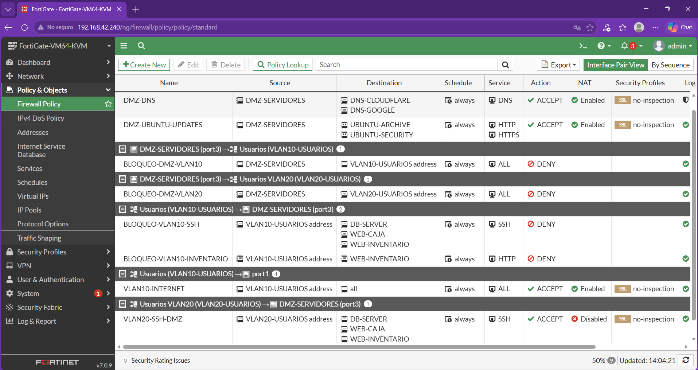

---

## 24.9 SSH permitido desde VLAN 20

Prueba de conexión SSH desde el equipo perteneciente a VLAN 20 hacia uno de los servidores de la DMZ.

Esta prueba demuestra que VLAN 20 tiene permitido administrar los servidores mediante SSH.

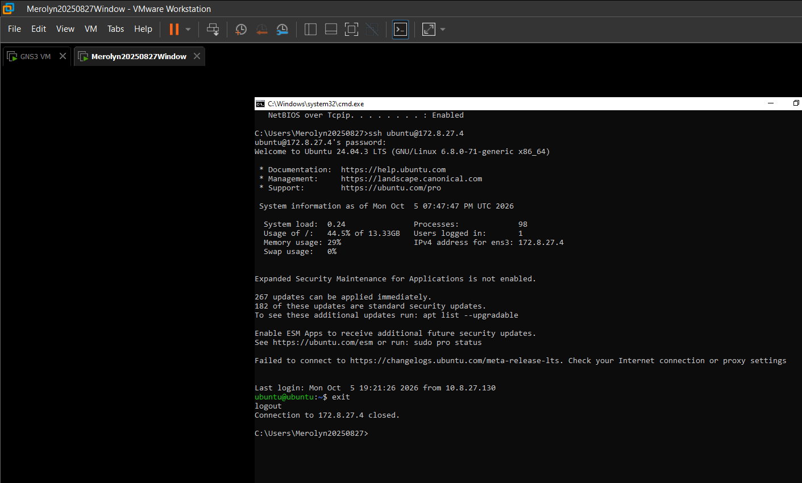

---

## 24.10 Registro de violaciones de políticas

Los registros del FortiGate muestran los intentos de comunicación bloqueados por las políticas de seguridad.

Entre las pruebas realizadas se encuentran:

- VLAN 10 intentando utilizar SSH hacia la DMZ.
- VLAN 10 intentando acceder al Sistema de Inventario.
- DMZ intentando iniciar comunicación hacia VLAN 10.
- DMZ intentando iniciar comunicación hacia VLAN 20.

Los eventos fueron registrados por FortiGate como tráfico denegado por las políticas correspondientes.

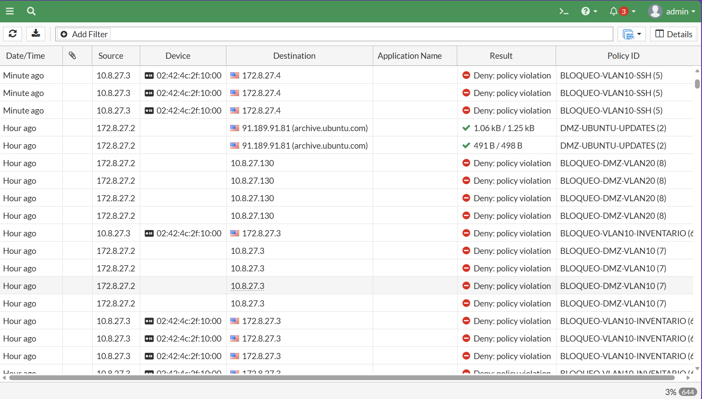

---

## 24.11 Actualizaciones permitidas desde la DMZ

Esta evidencia muestra la política utilizada para permitir únicamente las comunicaciones necesarias desde la DMZ hacia los servicios de actualización autorizados.

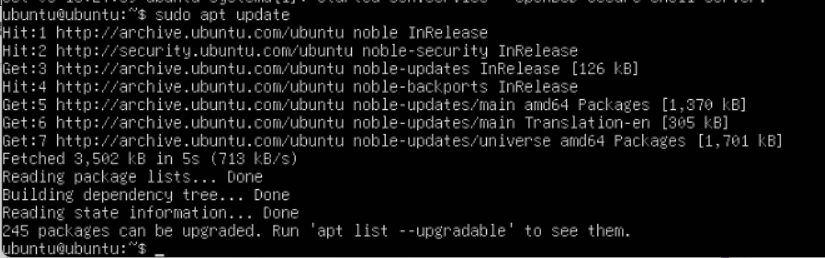

---

## 24.12 VLAN y enlace Trunk del switch

Se verificó la existencia de VLAN 10 y VLAN 20 y la configuración del enlace trunk entre el switch y el FortiGate.

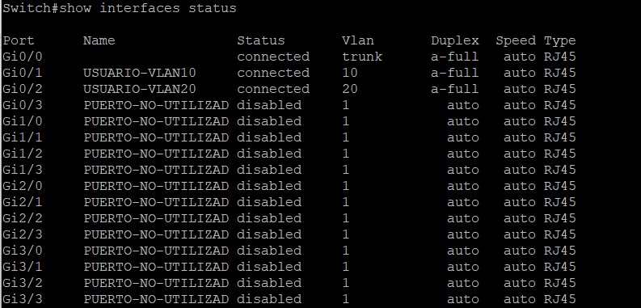

---

## 24.13 Port Security

Se verificó la configuración de Port Security en los puertos destinados a los usuarios.

La configuración utiliza direcciones MAC sticky y el modo de violación `restrict`.

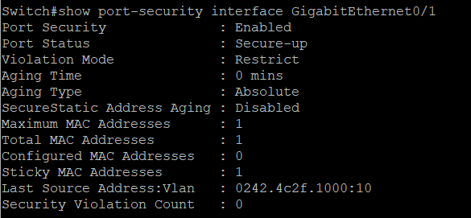

---

## 24.14 Estado de las VLAN del switch

La siguiente evidencia muestra las VLAN configuradas en el switch y los puertos asociados a cada una.

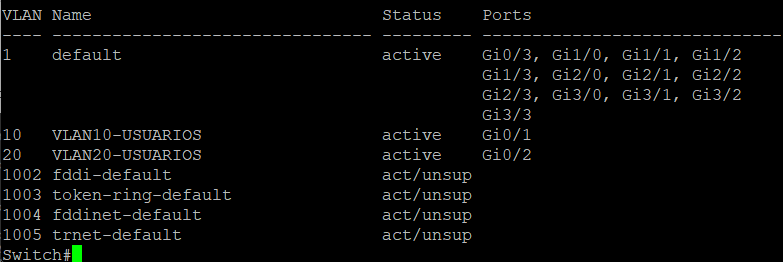

---

# 25. Conclusión

Con esta práctica se logró crear una infraestructura segmentada y aplicar diferentes controles de seguridad para proteger tanto a los usuarios como a los servidores.

La división entre VLAN 10, VLAN 20 y la DMZ permitió controlar mejor qué tipo de comunicación puede realizar cada equipo. Las políticas del FortiGate permitieron bloquear accesos no autorizados, limitar el acceso de los servidores hacia Internet y evitar que los equipos de la DMZ puedan iniciar conexiones hacia las redes internas.

También se aplicaron medidas de seguridad en el switch, como Port Security, BPDU Guard, desactivación de puertos no utilizados y administración mediante SSH.

Finalmente, las pruebas realizadas permitieron comprobar que las políticas funcionan de acuerdo con los objetivos establecidos para el laboratorio.
